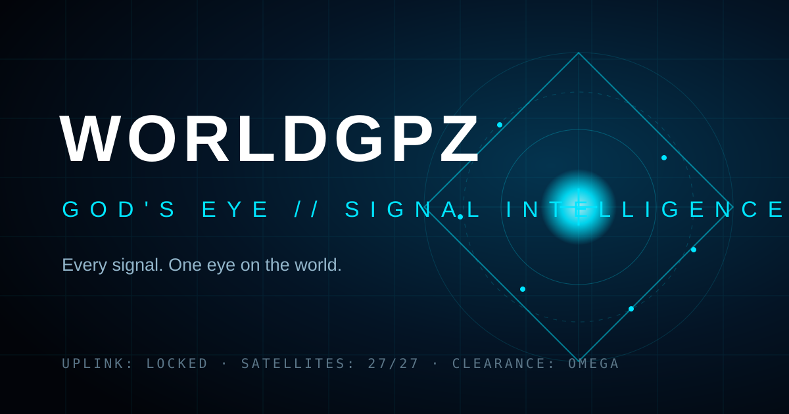

# WORLDGPZ 2.0

A production-oriented global intelligence monitor with a public situation room, live public data adapters, source health, AI-assisted briefings, and a protected administration console.



## What is included

- **Responsive command center** — live geospatial signal map, high-priority feed, filtering, source reports, trend visualization, and a composite watch index.
- **Map-first operations room** — compact operational chrome, time windows, region presets, independent layers, command palette, convergence board, intelligence panels, and mobile bottom navigation at `/operations`.
- **Live source adapters** — USGS magnitude 4.5+ earthquakes, Open-Meteo weather observations, NASA EONET natural events, ReliefWeb reports, and optional NewsAPI.
- **Live broadcast console** — server-side YouTube Data API discovery for seven curated networks, privacy-enhanced IFrame playback, persistent player controls, hidden-tab pausing, five-minute idle protection, and quota-aware shared caching.
- **Safe AI integration** — an optional OpenAI-compatible provider creates source-grounded briefs. Without a key, a deterministic rules engine provides a useful fallback.
- **Full admin console** — authenticated event creation, editing, deletion, source health, overview statistics, and an audit trail.
- **Persistent data** — PostgreSQL on Render; atomic local JSON storage for development.
- **Security defaults** — server-side secrets, bcrypt password hashes, expiring JWT sessions, role authorization, strict validation, rate limiting, CSP/Helmet headers, parameterized SQL, and generic authentication failures.
- **One-service deployment** — Express serves the API and the optimized React build, avoiding production CORS and cross-service configuration problems.

> WORLDGPZ is a decision-support interface, not an emergency service or an authoritative intelligence source. Consequential claims must be checked against the linked primary source.

## Stack

| Layer      | Technology                                                      |
| ---------- | --------------------------------------------------------------- |
| Frontend   | React 19, Vite 8, React Router, React Leaflet, Recharts, Lucide |
| Backend    | Node.js 22, Express 5, Zod, JWT, bcrypt                         |
| Data       | PostgreSQL in production; local JSON in development             |
| Deployment | Render Blueprint (`render.yaml`)                                |
| Tests      | Vitest and Supertest                                            |

## Quick start

Requirements: Node.js 22+ and npm 10+.

```bash
npm install
cp .env.example .env
```

Edit `.env`. At minimum, set unique values for:

```dotenv
JWT_SECRET=<at-least-32-random-characters>
ADMIN_EMAIL=<your-private-admin-email>
ADMIN_PASSWORD=<a-unique-password-with-at-least-12-characters>
```

Generate a JWT secret with:

```bash
openssl rand -base64 48
```

Start both development servers:

```bash
npm run dev
```

- Executive dashboard: `http://localhost:5173`
- Operations room: `http://localhost:5173/operations`
- API: `http://localhost:4000/api/health`
- Admin: `http://localhost:5173/login`

For the production-shaped local build:

```bash
npm run build
npm start
# Open http://localhost:4000
```

## Environment variables

All provider credentials belong in the **server environment**. Never prefix private values with `VITE_`; Vite variables are compiled into the public browser bundle.

| Variable                | Required            | Purpose                                                                      |
| ----------------------- | ------------------- | ---------------------------------------------------------------------------- |
| `JWT_SECRET`            | Production          | Signs administrator sessions; 32+ random characters                          |
| `ADMIN_EMAIL`           | Production          | Bootstrap administrator email                                                |
| `ADMIN_PASSWORD`        | Production          | Bootstrap password; 12+ characters                                           |
| `DATABASE_URL`          | Production          | PostgreSQL connection string (injected by Render)                            |
| `DATABASE_SSL`          | No                  | Set `true` only when your external PostgreSQL provider requires it           |
| `NEWS_API_KEY`          | No                  | Adds NewsAPI headlines; ReliefWeb remains the fallback                       |
| `YOUTUBE_API_KEY`       | No                  | Discovers current live broadcasts; remains server-side                       |
| `YOUTUBE_CACHE_SECONDS` | No                  | Live-discovery cache; defaults to 10,800 seconds (3 hours)                   |
| `OPENWEATHER_API_KEY`   | No                  | Adds eight global current-weather watch points; Open-Meteo remains available |
| `AI_API_KEY`            | No                  | Enables an OpenAI-compatible briefing provider                               |
| `AI_BASE_URL`           | No                  | Defaults to `https://api.openai.com/v1`                                      |
| `AI_MODEL`              | No                  | Defaults to `gpt-4o-mini`                                                    |
| `CORS_ORIGINS`          | Local/split hosting | Comma-separated allowed browser origins                                      |

The bootstrap admin is created when its email does not exist. On later starts, the configured `ADMIN_NAME` and `ADMIN_PASSWORD` are reconciled to that bootstrap account, so rotating the password in Render and redeploying invalidates the previous password.

## Scripts

```bash
npm run dev          # API + Vite development servers
npm run build        # Optimized frontend build
npm start            # Express API + built frontend
npm test             # Server integration and client unit tests
npm run verify       # Tests + build + production dependency audit
npm run scan:live -- https://worldgpz.onrender.com  # Safe public-route/provider scan
```

## API summary

### Public

- `GET /api/health`
- `GET /api/v1/dashboard`
- `GET /api/v1/events`
- `GET /api/v1/sources`
- `GET /api/v1/news`
- `GET /api/v1/providers`
- `GET /api/v1/media/channels`
- `GET /api/v1/webcams|weather|markets|fires|conflicts|ships|flights|outages|energy|macro`
- `POST /api/v1/intelligence/brief`

### Authentication

- `POST /api/auth/login`
- `GET /api/auth/me`
- `POST /api/auth/logout`

### Admin (Bearer token and `admin` role required)

- `GET /api/admin/overview`
- `GET|POST /api/admin/events`
- `PATCH|DELETE /api/admin/events/:id`
- `GET /api/admin/audit`

## Repository structure

```text
worldgpz/
├── client/              React application and static brand assets
├── server/              API, persistence, source adapters, and tests
├── docs/                audit and deployment runbooks
├── scripts/             safe production diagnostics
├── .env.example         safe configuration template
├── render.yaml          one-click Render Blueprint
└── package.json         npm workspaces and verification scripts
```

## Deployment

Follow [`docs/DEPLOY_RENDER.md`](docs/DEPLOY_RENDER.md). The checked-in `render.yaml` provisions a web service and PostgreSQL database together. Provider setup, quota behavior, live-video architecture, and the additional keys needed for broader coverage are documented in [`docs/API_KEYS_AND_LIVE_MEDIA.md`](docs/API_KEYS_AND_LIVE_MEDIA.md).

## Security notice from the rebuild

The previous repository snapshot contained provider keys in tracked Markdown and a hardcoded demonstration administrator password. Those values must be considered compromised and revoked at their providers. Deleting them in this commit does not erase them from Git history or existing clones. See [`docs/FORENSIC_AUDIT.md`](docs/FORENSIC_AUDIT.md).
